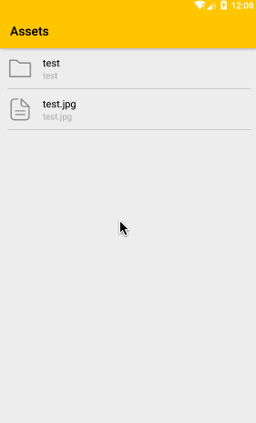

# AssetsFile
更方便的操作Assets资源



### Gradle
```
implementation 'com.dyhdyh.io:asset-file:1.0.0'
```

### AssetFile
使用方法跟`java.io.File`相似  

```
//创建AssetFile
new AssetFile();

new AssetFile(assetPath);

new AssetFile(parent,child);

//获取文件或目录名称
assetFile.getName();

//获取父级目录
assetFile.getParentFile();

//转换Uri
assetFile.getUri();
```


### AssetsManager
```
AssetsManager assetsManager = new AssetsManager(context);

//从asset复制文件到手机目录
assetsManager.copyAssetFile(assetFile, saveFile);

//从asset复制文件夹或文件到手机目录
assetsManager.copyAsset(assetFile, saveDir);
```